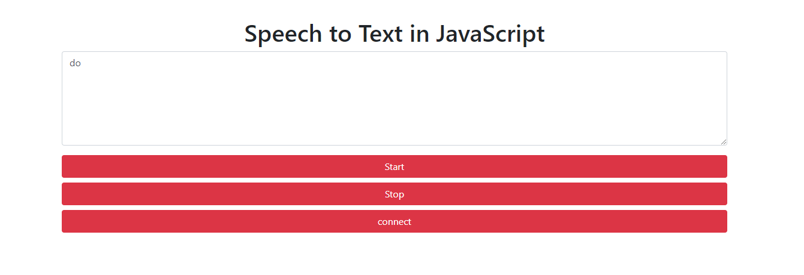

# Web-Serial-API-Task2

Create a web page to control the bot's arm
This code using HTML, JavaScript and C++, is used to convert voice to type and control arm bot by arduino

## Interface

## Technologies
Web APIs

## Reference
https://web.dev/serial/
